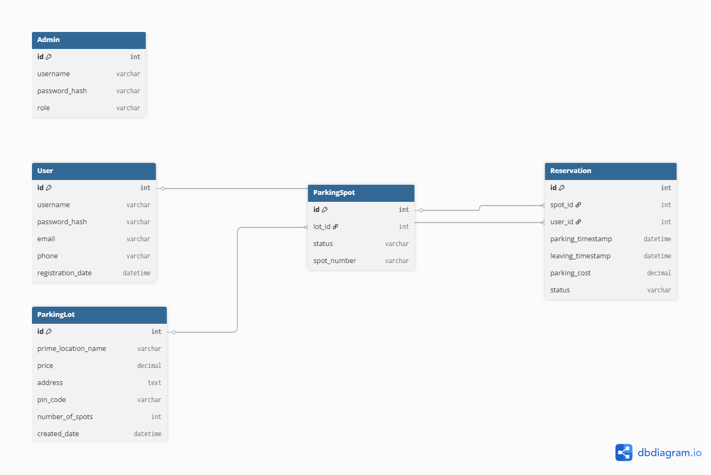

# ParkIndia – Parking Management System

> Modern Application Development II Project Submission  
> **Student Name**: Aryan Sanjay Patil  
> **Roll Number**: 23f1000968  
> **Email**: 23f1000968@ds.study.iitm.ac.in

---

## Project Overview

**ParkIndia** is a fully local, demo-friendly parking orchestration platform. Administrators and drivers work inside the same stack, but every screen honours role-based access rules enforced through JWTs. Automatic spot assignment, accurate billing based on timestamps, Redis-backed caching, real-time charts, and Celery-driven background jobs keep the experience responsive while remaining easy to run on a MacBook Air M2.

---

## Technology Stack

### Backend Technologies
- **Flask** – RESTful API framework and server-side application logic
- **Flask-SQLAlchemy** – Object-relational mapping for SQLite database interactions
- **JWT (PyJWT)** – Token-based authentication and authorization
- **SQLite** – Embedded relational database for data persistence
- **Redis** – In-memory data store for caching and message queue
- **Celery** – Distributed task queue for background job execution
- **Celery Beat** – Task scheduler for periodic operations

### Frontend Technologies
- **Vue.js 3** – Progressive JavaScript framework for building reactive user interfaces
- **Vue Router** – Client-side routing and navigation
- **Bootstrap 5** – Responsive CSS framework for UI styling
- **Chart.js** – Data visualization library for analytics charts
- **Axios** – HTTP client for API communication
- **Vite** – Fast build tool and development server

---

## Database Schema

The application uses SQLite with the following table structure:



### Tables

1. **User** – Stores user account information
2. **ParkingLot** – Contains parking facility details
3. **ParkingSpot** – Individual parking space records
4. **Reservation** – Tracks parking session transactions

---

## Core Features

### Authentication & Authorization
- Secure user registration and login
- JWT-based session management
- Role-based access control (Admin/User)
- Automatic admin account creation on database initialization

### Administrator Capabilities
- Create and configure new parking lots
- Modify lot details and spot counts
- Delete empty parking lots
- View all registered users
- Monitor individual spot status
- Access detailed vehicle information
- Generate summary analytics and charts
- Export parking reports as CSV files

### User Functionality
- Browse available parking lots
- Reserve parking spots
- Occupy reserved spots
- Release spots and complete sessions
- View personal parking history
- Access individual usage analytics

### System Features
- Real-time spot availability updates with caching fallback
- Automatic cost calculation based on parking duration
- Redis caching for improved performance with expiry
- Background email notifications via Celery workers
- Scheduled CSV/summary emails every 2 minutes (demo-friendly interval)
- Interactive data visualization dashboards on both admin and user circuits

---

## Local Setup Instructions

### Prerequisites
- Python 3.8 or higher
- Node.js 16 or higher
- Redis server
- MailHog (for email testing in development)

### Backend Setup

```bash
# Navigate to backend directory
cd backend

# Create virtual environment
python -m venv venv

# Activate virtual environment
# On macOS/Linux:
source venv/bin/activate
# On Windows:
# venv\Scripts\activate

# Install dependencies
pip install -r requirements.txt

# One-liner to bootstrap demo DB and run the server
python3 seed_db.py && python3 app.py
```

The backend server will run on `http://localhost:5000`

### Frontend Setup

```bash
# Navigate to frontend directory
cd frontend

# Install dependencies
npm install

# Start development server
npm run dev
```

The frontend application will run on `http://localhost:5173`

### Multi-terminal Run Order (5+ windows)

1. **Terminal 1 – Redis**
   ```bash
   redis-server
   ```
2. **Terminal 2 – MailHog**
   ```bash
   mailhog
   ```
3. **Terminal 3 – Backend (virtualenv)**
   ```bash
   cd backend
   source venv/bin/activate
   python3 seed_db.py && python3 app.py
   ```
4. **Terminal 4 – Celery Worker**
   ```bash
   cd backend
   source venv/bin/activate
   celery -A celery_app worker --loglevel=info
   ```
5. **Terminal 5 – Celery Beat (schedules CSV emails every 2 minutes)**
   ```bash
   cd backend
   source venv/bin/activate
   celery -A celery_app beat --loglevel=info
   ```
6. **Terminal 6 – Frontend**
   ```bash
   cd frontend
   npm run dev
   ```

**Notes**
- MailHog UI: `http://localhost:8025`
- Celery beat queues `dispatch_scheduled_report` every two minutes, ensuring rubric item #19 is met.
- `.env.example` documents every configurable setting. Copy it to `.env` only if you need overrides.

---

## Default Credentials

After initial setup, an admin account is automatically created:
- **Username**: `admin`
- **Password**: `admin123`

### Sample User Accounts (after running seed_db.py)

The seeding script creates 5 sample users for testing:
- **user1** / **user1pass**
- **user2** / **user2pass**
- **user3** / **user3pass**
- **user4** / **user4pass**
- **user5** / **user5pass**

These users are pre-loaded with historic and active reservations so dashboards, reports, and charts contain meaningful information immediately after startup.

---

## Project Structure

```
ParkIndia/
├── backend/
│   ├── app.py                 # Flask application entry point
│   ├── config.py              # Application configuration
│   ├── models.py              # Database models
│   ├── auth.py                # Authentication utilities
│   ├── cache.py               # Redis caching functions
│   ├── mail.py                # Email sending functions
│   ├── tasks.py               # Celery task definitions
│   ├── celery_app.py          # Celery instance
│   ├── routes/                # API route handlers
│   │   ├── auth_routes.py     # Authentication endpoints
│   │   ├── api_routes.py      # General API endpoints
│   │   ├── admin_routes.py    # Admin-specific endpoints
│   │   └── user_routes.py     # User-specific endpoints
│   ├── instance/              # Database files
│   └── reports/               # Generated CSV reports
├── frontend/
│   ├── src/
│   │   ├── App.vue            # Main application component
│   │   ├── main.js            # Application entry point
│   │   ├── router/            # Vue Router configuration
│   │   ├── views/             # Page components
│   │   └── components/        # Reusable components
│   └── package.json           # Frontend dependencies
└── README.md                  # This file
```

---

## Demo / Presentation

[\[Demo Walkthrough\]](https://drive.google.com/file/d/13CBXNptcr7b8RPb6hEMU6ZucrVICSjTh/view?usp=sharing)

---

## Notes

- The application is optimised for macOS on Apple Silicon (tested on MacBook Air M2).
- All five terminals listed above must stay running for the complete demo (frontend, backend, Redis, MailHog, Celery worker + beat).
- Email functionality uses MailHog for local development testing—no external SMTP credentials are required.
- Celery beat schedules the CSV/summary report every 2 minutes for grading convenience.
- Redis caching improves API response times significantly and can be verified via `/api/lots` and `/api/spots`.
- Vue DevTools overlay is disabled by default; set `VITE_ENABLE_DEVTOOLS=true` in an `.env` file inside `frontend/` if you need it during troubleshooting.

---

## Rubric Self-Checklist

| # | Requirement | How to Verify |
|---|-------------|---------------|
| 1 | App runs inside 10 minutes | Follow the multi-terminal guide; every service starts within seconds. |
| 2 | JWT + RBAC | `/auth/login` issues JWT; admin-only routes enforce `@admin_required`. |
| 3 | Approved tech stack | Flask + Vue + Redis + Celery only. |
| 4 | Backend APIs | See `backend/routes` for REST endpoints. |
| 5 | Admin creates lots | `POST /api/admin/lots` or Admin UI “Create Lot”. |
| 6 | Admin adjusts spot count | `PUT /api/admin/lots/<id>` handles increases/decreases with validation. |
| 7 | Delete empty lots | `DELETE /api/admin/lots/<id>` blocked if spots occupied. |
| 8 | User books spot | `/api/reserve` + User dashboard “Reserve” button. |
| 9 | User chooses specific lot | `/api/lots` + UI lot picker show availability counts. |
|10 | Occupy spot | Reserving automatically marks underlying `ParkingSpot.status='O'`. |
|11 | Vacate spot | `/api/release` handles completion and billing. |
|12 | Admin views spot status | `/api/admin/lots/<id>` and Admin dashboard cards. |
|13 | Admin views reservation details | CSV export + dashboard summaries display user/vehicle info. |
|14 | Admin lists users | `/api/admin/users` powering the Users page. |
|15 | Admin summary charts | Admin dashboard + Admin summary use Chart.js. |
|16 | Timestamp-based billing | `Reservation.parking_cost` derived from start/end timestamps. |
|17 | User summary charts | `/user/summary` view renders cards/insights for the logged-in user. |
|18 | Auto admin creation | `app.py` seeds admin if missing on startup. |
|19 | Scheduled monthly-style reports | Celery beat task `dispatch_scheduled_report` emails CSV every 2 minutes. |
|20 | User-triggered report jobs | Manual CSV export `/api/admin/export-csv` queues Celery job + emails via MailHog. |
|21 | Redis caching with expiry | `cache.py` caching decorator and `/api/lots`/`/api/spots` use `cache_set` with TTL. |

---

## License

This project is developed as part of the Modern Application Development II course at IIT Madras.
