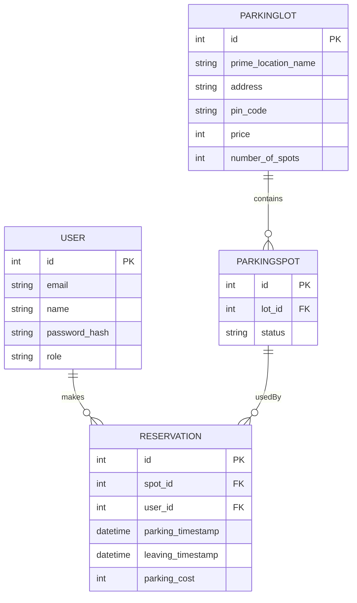

# Project Report – Vehicle Parking App V2

## Author
- Name: Aryan Patil
- Roll: 23f1000968
- Email: 23f1000968@ds.study.iitm.ac.in

## Description
Multi-user parking management for 4-wheelers. Admin manages lots/spots and users book first-available spots, release, and view history. Async jobs handle reminders, monthly summaries, and CSV export. Built to run locally on macOS.

## Technologies
- Flask, Flask-Login, Flask-SQLAlchemy, Flask-Caching
- SQLite, Redis, Celery
- Vue 3 (CDN) + Bootstrap 5
- pandas (CSV helpers)

## DB Schema (ER – simplified)

## APIs (high level)
- `/api/auth/register|login|logout|me`
- `/api/admin/lots [GET|POST]`, `/api/admin/lots/<id> [PUT|DELETE]`, `/api/admin/users`, `/api/admin/spots/<lot_id>`
- `/api/user/lots`, `/api/user/book`, `/api/user/release`, `/api/user/history`, `/api/user/export`

## Architecture & Features
- `backend/` Flask app factory with SQLAlchemy, LoginManager, Redis cache. Blueprints under `routes/`.
- `frontend/` single-page Vue (CDN) served by Flask static folder.
- Features: role-based access, auto spot generation, first-available booking, cost computed on release, history view, CSV export via Celery, cached list endpoints.

## Video
- Adding a short demo link here in coming time!

## AI/LLM Usage
- Assisted with scaffolding and boilerplate. All logic reviewed and adapted.

